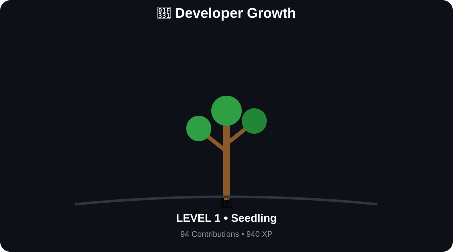

<!-- 

  

 -->

<svg
  width="1200"
  height="400"
  viewBox="0 0 1200 400"
  xmlns="http://www.w3.org/2000/svg"
>

  <defs>

    <linearGradient
      id="background"
      x1="0%"
      y1="0%"
      x2="100%"
      y2="100%"
    >
      <stop offset="0%" stop-color="#050505"/>
      <stop offset="100%" stop-color="#101010"/>
    </linearGradient>

    <filter id="glow">
      <feGaussianBlur stdDeviation="4" result="blur"/>
      <feMerge>
        <feMergeNode in="blur"/>
        <feMergeNode in="SourceGraphic"/>
      </feMerge>
    </filter>

  </defs>

  <!-- Background -->

  <rect
    width="1200"
    height="400"
    rx="20"
    fill="url(#background)"
  />

  <!-- Border -->

  <rect
    x="10"
    y="10"
    width="1180"
    height="380"
    rx="18"
    fill="none"
    stroke="#303030"
    stroke-width="2"
  />

  <!-- Terminal header -->

  <rect
    x="10"
    y="10"
    width="1180"
    height="45"
    rx="18"
    fill="#151515"
  />

  <circle cx="35" cy="32" r="7" fill="#ff5f56"/>
  <circle cx="58" cy="32" r="7" fill="#ffbd2e"/>
  <circle cx="81" cy="32" r="7" fill="#27c93f"/>

  <text
    x="600"
    y="38"
    text-anchor="middle"
    fill="#777777"
    font-family="monospace"
    font-size="14"
  >
    developer@github: ~
  </text>

  <!-- Terminal content -->

  <text
    x="80"
    y="105"
    fill="#27c93f"
    font-family="monospace"
    font-size="20"
  >
    $ whoami
  </text>

  <text
    x="80"
    y="140"
    fill="#ffffff"
    font-family="monospace"
    font-size="30"
    font-weight="bold"
  >
    MohammadAmin
  </text>

  <text
    x="80"
    y="180"
    fill="#27c93f"
    font-family="monospace"
    font-size="20"
  >
    $ role
  </text>

  <text
    x="80"
    y="215"
    fill="#ffffff"
    font-family="monospace"
    font-size="24"
  >
    Frontend Developer
  </text>

  <text
    x="80"
    y="260"
    fill="#27c93f"
    font-family="monospace"
    font-size="20"
  >
    $ stack
  </text>

  <text
    x="80"
    y="295"
    fill="#bbbbbb"
    font-family="monospace"
    font-size="20"
  >
    React  •  JavaScript  •  Redux  •  Tailwind
  </text>

  <!-- Status -->

  <text
    x="80"
    y="345"
    fill="#27c93f"
    font-family="monospace"
    font-size="18"
    filter="url(#glow)"
  >
    &gt; Building something...
  </text>

  <!-- Right side code -->

  <text
    x="760"
    y="115"
    fill="#444444"
    font-family="monospace"
    font-size="17"
  >
    const developer = {
  </text>

  <text
    x="790"
    y="145"
    fill="#777777"
    font-family="monospace"
    font-size="17"
  >
    name: "MohammadAmin",
  </text>

  <text
    x="790"
    y="175"
    fill="#777777"
    font-family="monospace"
    font-size="17"
  >
    role: "Frontend Developer",
  </text>

  <text
    x="790"
    y="205"
    fill="#777777"
    font-family="monospace"
    font-size="17"
  >
    stack: [
  </text>

  <text
    x="820"
    y="235"
    fill="#27c93f"
    font-family="monospace"
    font-size="17"
  >
    "React",
  </text>

  <text
    x="820"
    y="265"
    fill="#27c93f"
    font-family="monospace"
    font-size="17"
  >
    "JavaScript",
  </text>

  <text
    x="820"
    y="295"
    fill="#27c93f"
    font-family="monospace"
    font-size="17"
  >
    "Redux",
  </text>

  <text
    x="820"
    y="325"
    fill="#27c93f"
    font-family="monospace"
    font-size="17"
  >
    "Tailwind"
  </text>

  <text
    x="790"
    y="355"
    fill="#777777"
    font-family="monospace"
    font-size="17"
  >
    ]
  </text>

  <text
    x="760"
    y="380"
    fill="#444444"
    font-family="monospace"
    font-size="17"
  >
    };
  </text>

</svg>

## ⚡ Skills & Technologies

<table>
<tr>
<td align="center">

### 🧠 Languages

</td>

<td align="center">

### ⚛️ Frontend

</td>

<td align="center">

### 🛠️ Backend

</td>

<td align="center">

### 🔧 Tools

</td>
</tr>
</table>

### 🎯 My Current Stack

| Technology | Level |
|:----------:|:-----:|
| 🟨 JavaScript | ⭐⭐⭐⭐⭐|
| ⚛️ React | ⭐⭐⭐⭐ |
| 🎨 Tailwind CSS | ⭐⭐⭐⭐⭐|
| 🧠 Redux Toolkit | ⭐⭐⭐ |
| 🟢 Node.js | ⭐ |
| 🚂 Express.js | ⭐ |
| 🧭 React Router | ⭐⭐⭐⭐ |
| 🎨 Figma | ⭐⭐ |

 <h2 align="center">🌳 Developer Growth</h2>

  

 

<h2 align="center">🐍 My Contributions</h2>

  <picture>
    <source
      media="(prefers-color-scheme: dark)"
      srcset="https://raw.githubusercontent.com/MohammadAmin-1389/MohammadAmin-1389/output/github-snake-dark.svg"
    />
    
  </picture>

